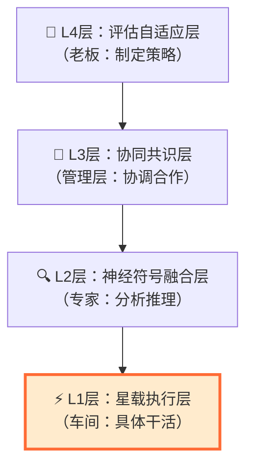
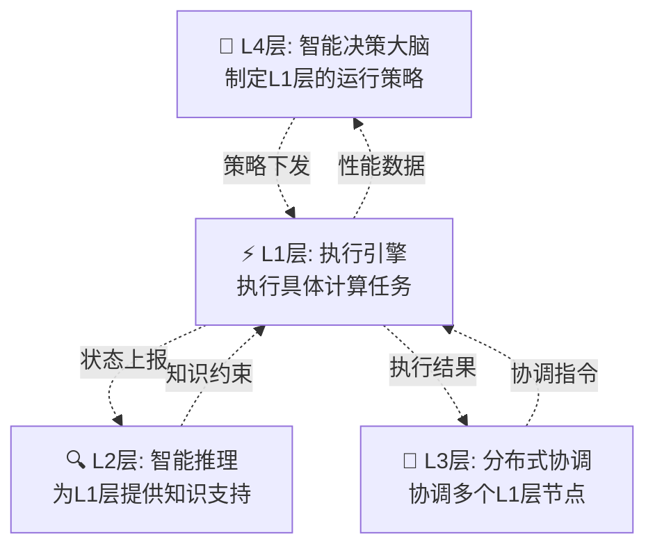

# 🛰️ L1层星载执行层详解（初学者指南）

## 📚 目录
- [1. L1层是什么？](#1-l1层是什么)
- [2. L1层在整个系统中的位置](#2-l1层在整个系统中的位置)
- [3. L1层的四大核心组件](#3-l1层的四大核心组件)
- [4. 详细技术实现](#4-详细技术实现)
- [5. 实际应用场景](#5-实际应用场景)
- [6. 性能指标与优化](#6-性能指标与优化)
- [7. 与其他层的协作](#7-与其他层的协作)

---


### 💡 为什么叫"星载执行层"？

- **星载**：运行在卫星上的计算设备
- **执行**：负责实际执行计算任务
- **层**：分层架构中的基础层

### 🎪 L1层的主要职责

L1层就像是卫星的"大脑皮层"，负责：

1. **接收数据**：从传感器获取原始数据（温度、图像等）
2. **处理数据**：使用AI模型进行智能分析
3. **做出决策**：快速判断是否有火灾等紧急情况
4. **传输结果**：将处理结果发送给其他卫星或地面

---

## 2. L1层在整个系统中的位置

### 🏗️ 四层架构总览



### 📊 数据流动过程

```
🌍 地面指挥中心
    ↓ (发送火灾监测任务)
🛰️ 卫星接收任务
    ↓ (原始数据：温度、图像等)
⚡ L1层处理
    ↓ (处理后的智能结果)
🔍 L2层分析
    ↓ (更深层的推理)
🤝 L3层协调
    ↓ (多卫星协作)
🧠 L4层决策
    ↓ (最终决策)
🌍 地面指挥中心（接收结果）
```


## 3. L1层的四大核心组件

L1层包含四个主要组件，每个组件负责不同的任务：

### 📋 组件总览

```
L1层星载执行层
├── 🔄 编码器ENC（数据预处理专家）
├── 🚦 路由CTX（智能调度员）
├── 🧠 生成DEC（AI推理引擎）
└── 📡 传输EDGE（通信管理员）
```

### 🔄 组件1：编码器ENC（数据预处理专家）

**作用**：把原始数据转换成AI能理解的格式

**比喻**：就像翻译官，把各种语言翻译成通用语言

```python
# 编码器的工作流程
原始数据 → 预处理 → 特征提取 → 标准化格式

# 例子：火灾图像处理
火灾照片(像素) → 去噪声 → 提取边缘/纹理 → 标准向量
```

### 🚦 组件2：路由CTX（智能调度员）

**作用**：决定用哪个AI模型来处理当前数据

```python
# 路由器的决策过程
输入数据 → 分析特征 → 选择最适合的模型 → 发送给对应模型

# 例子：
简单火情 → 选择轻量模型A
复杂火情 → 选择精确模型B
```

### 🧠 组件3：生成DEC（AI推理引擎）

**作用**：使用AI模型进行智能推理和预测

```python
# 推理引擎的工作过程
标准化数据 → AI模型计算 → 生成预测结果 → 输出答案

# 例子：火灾检测
图像特征 → 深度学习模型 → 计算火灾概率 → 输出：90%可能性有火灾
```

### 📡 组件4：传输EDGE（通信管理员）

**作用**：负责与其他卫星和地面的通信

**比喻**：就像邮递员，负责收发信息

```python
# 传输组件的功能
结果打包 → 选择传输路径 → 发送数据 → 确认接收

# 例子：
火灾警报 → 加密打包 → 发送给地面站 → 确认收到
```

---

## 4. 详细技术实现

### 🔄 编码器ENC详细实现

#### **轻量化视觉网络**

**什么是轻量化？**
想象一个胖子要减肥：
- 原始AI模型 = 200斤的胖子（太重，跑不动）
- 轻量化模型 = 120斤的运动员（轻便，跑得快）

```python
# 轻量化技术组合
原始模型: 150MB, 需要2GB内存
    ↓ 剪枝技术（去掉不重要的神经元）
    ↓ 量化技术（用更少的数字位数）
    ↓ 知识蒸馏（大模型教小模型）
轻量模型: 15MB, 需要200MB内存

# 压缩效果
模型大小: 减少90%
内存需求: 减少90%
速度提升: 提高5-10倍
精度损失: 仅损失1-3%
```

#### **三种压缩技术详解**

**1. 剪枝技术（Pruning）**
```
🌳 剪枝就像修剪树枝：
完整的树 → 剪掉不重要的枝叶 → 保留主干和重要分支

神经网络剪枝：
1000个神经元 → 剪掉500个不重要的 → 保留500个重要的
效果：模型变小，速度变快，精度略降
```

**2. 量化技术（Quantization）**
```
📊 量化就像压缩图片质量：
高清图片(10MB) → 压缩 → 标清图片(2MB)

数字精度量化：
32位浮点数 → 8位整数
存储需求：减少75%
计算速度：提高2-4倍
```

**3. 知识蒸馏（Knowledge Distillation）**
```
👨‍🏫 知识蒸馏就像老师教学生：
大模型(老师) → 传授知识 → 小模型(学生)

实现过程：
1. 训练一个大而准确的模型(老师)
2. 用大模型的输出训练小模型(学生)
3. 小模型学会了大模型的"经验"
```

#### **具体技术参数**

```python
# 编码器ENC配置
轻量视觉网络:
    - 剪枝比例: 30-50%
    - 量化精度: INT8 (8位整数)
    - 蒸馏温度: T=2
    - 目标压缩: 90%以上

输出格式:
    - 半精度嵌入: FP16 (16位浮点数)
    - 语义向量: 512维标准化向量
    - 处理时间: <10ms每帧
```

### 🚦 路由CTX详细实现

#### **Top-2 MoE (专家混合)路由**

**什么是专家混合？**
想象一个医院有多个专科医生：
- 心脏病专家：擅长心脏问题
- 骨科专家：擅长骨头问题
- 全科医生：什么都会一点

```python
# MoE路由工作原理
输入: 火灾相关图像
    ↓ 特征分析
路由器判断: 这是烟雾检测问题
    ↓ 选择专家
选择: 烟雾检测专家 + 温度分析专家 (Top-2)
    ↓ 并行处理
输出: 两个专家的结果融合
```

#### **智能路由策略**

```python
# 路由决策因素
1. 数据特征相似度
   图像特征 → 计算与各专家训练数据的相似度 → 选择最匹配的

2. 带宽感知
   当前网络带宽 → 选择合适复杂度的模型 → 保证实时性

3. 负载均衡
   各专家当前负载 → 选择负载较轻的专家 → 避免过载

### 🧠 生成DEC详细实现

#### **Beam Search（束搜索）**

**什么是束搜索？**
想象你在走迷宫找出口：
- 普通方法：每次只走一条路（可能走错）
- 束搜索：同时走4条最有希望的路（beam=4）

```python
# 束搜索在火灾检测中的应用
输入: 模糊的火灾图像
    ↓ 生成多个可能的解释
候选1: 90%概率是火灾
候选2: 85%概率是烟雾
候选3: 80%概率是反光
候选4: 75%概率是云层
    ↓ 选择最可能的解释
输出: 90%概率是火灾 (最佳答案)
```

#### **核采样（Nucleus Sampling）**

**什么是核采样？**
想象你在做选择题：
- 普通方法：总是选最可能的答案（可能太死板）
- 核采样：在最可能的几个答案中随机选择（增加多样性）

```python
# 核采样参数 p=0.9
所有候选答案的概率:
候选A: 50%
候选B: 30% 
候选C: 15%
候选D: 3%
候选E: 2%

累积概率超过90%的候选(核心集合):
候选A + 候选B + 候选C = 95% > 90%

从核心集合{A,B,C}中随机选择，忽略{D,E}
```

#### **受限解码（DFA/CFG）**

**什么是受限解码？**
就像给AI戴上"安全帽"，确保它的回答符合规则：

```python
# 火灾检测的约束规则
规则1: 温度必须 > 0°C 且 < 100°C
规则2: 火灾概率必须在0-1之间
规则3: 位置坐标必须在监测区域内
规则4: 不能同时报告"无火灾"和"高温警报"

# 受限解码确保输出符合所有规则
AI原始输出: 温度=-10°C, 火灾概率=1.2
    ↓ 规则检查
发现违规: 温度不能为负，概率不能>1
    ↓ 修正
最终输出: 温度=25°C, 火灾概率=0.9
```

### 📡 传输EDGE详细实现

#### **低时延RPC协议**

**什么是RPC？**
RPC = Remote Procedure Call（远程过程调用）
就像打电话：你说"帮我查一下天气"，对方查完告诉你结果

```python
# 低时延RPC的优化
普通HTTP请求: 需要100-500ms
优化RPC协议: 只需要10-50ms

优化技术:
1. 连接池: 提前建立连接，不用每次重新连接
2. 数据压缩: 减少传输的数据量
3. 二进制协议: 比文本协议更高效
4. 异步处理: 不等待响应就能发送下一个请求
```

#### **数字签名机制**

**为什么需要数字签名？**
确保消息的真实性和完整性，就像身份证：

```python
# 数字签名过程
1. 发送方用私钥对消息签名
2. 接收方用公钥验证签名
3. 如果验证通过，说明消息未被篡改

火灾警报消息:
原始消息: "检测到火灾，位置(120.5, 30.2)"
    ↓ 私钥签名
签名消息: 消息 + 数字签名
    ↓ 传输
接收方用公钥验证 → 确认消息真实有效
```

#### **LRU缓存策略**

**什么是LRU？**
LRU = Least Recently Used（最近最少使用）
就像整理房间，把最久没用的东西扔掉：

```python
# LRU缓存示例
缓存容量: 只能存储100个结果
当缓存满了，新数据进来时:
1. 找到最久没用的数据
2. 删除这个数据
3. 存入新数据

缓存中的数据按使用时间排序:
最新: 火点A的检测结果 (1分钟前)
     火点B的检测结果 (5分钟前)
     火点C的检测结果 (10分钟前)
最旧: 火点D的检测结果 (30分钟前) ← 会被删除
```

#### **A/B升级与回滚**

**什么是A/B升级？**
就像试用新软件，保留旧版本作为备份：

```python
# A/B升级流程
当前版本: A版本 (稳定运行)
新版本: B版本 (需要测试)

升级过程:
1. 保持A版本继续运行
2. 在部分卫星上部署B版本
3. 对比A和B的性能
4. 如果B版本更好 → 全面升级到B
5. 如果B版本有问题 → 回滚到A

回滚能力:
- 24小时内可以快速回滚
- 自动检测异常并触发回滚
- 保证系统持续稳定运行
```

---

## 5. 实际应用场景

### 🔥 森林火灾监测完整流程

让我们通过一个具体例子来看L1层是如何工作的：

#### **场景设定**
```
时间: 2024年夏天，下午2点
地点: 某森林保护区
天气: 高温干燥，风力3级
任务: 实时监测森林火灾
```

#### **步骤1：数据采集**
```
🛰️ 卫星传感器数据:
- 红外相机: 检测到温度异常区域
- 可见光相机: 拍摄到疑似烟雾
- 温度传感器: 读数45°C (异常高温)
- GPS定位: 经度120.5°, 纬度30.2°
- 时间戳: 2024-07-15 14:30:00
```

#### **步骤2：L1层处理开始**

**🔄 编码器ENC工作：**
```python
# 数据预处理
原始图像: 1920×1080像素，8MB
    ↓ 轻量化处理
压缩图像: 224×224像素，100KB
    ↓ 特征提取
特征向量: 512维数值 [0.1, 0.8, 0.3, ...]
    ↓ 标准化
标准特征: 归一化到[0,1]区间

处理时间: 8ms
```

**🚦 路由CTX决策：**
```python
# 智能路由选择
输入特征分析:
- 高温特征权重: 0.8
- 烟雾特征权重: 0.9
- 地形特征权重: 0.6

专家模型匹配度:
- 火灾检测专家: 匹配度 95%
- 烟雾分析专家: 匹配度 90%
- 植被分析专家: 匹配度 60%

选择结果: Top-2专家 = [火灾检测专家, 烟雾分析专家]
路由时间: 2ms
```

**🧠 生成DEC推理：**
```python
# AI模型推理
火灾检测专家推理:
输入: 标准化特征向量
    ↓ 深度学习计算
输出: 火灾概率 = 0.92 (92%)

烟雾分析专家推理:
输入: 标准化特征向量  
    ↓ 深度学习计算
输出: 烟雾浓度 = 0.85 (85%)

融合决策:
综合概率 = 0.92 × 0.6 + 0.85 × 0.4 = 0.892
    ↓ 受限解码检查
规则验证: 温度>40°C ✓, 概率范围[0,1] ✓, 位置有效 ✓
    ↓ 最终结果
火灾警报: 89.2%概率检测到火灾

推理时间: 15ms
```

**📡 传输EDGE通信：**
```python
# 结果打包传输
警报消息构建:
{
    "type": "fire_alert",
    "probability": 0.892,
    "location": {"lat": 30.2, "lon": 120.5},
    "temperature": 45.0,
    "smoke_density": 0.85,
    "timestamp": "2024-07-15T14:30:00Z",
    "confidence": "high"
}

    ↓ 数字签名
签名验证: 使用私钥签名确保真实性
    ↓ 加密传输
加密算法: AES-256加密
    ↓ 发送
目标: 地面指挥中心 + 相邻卫星节点

传输时间: 5ms
总处理时间: 8+2+15+5 = 30ms < 50ms目标 ✓
```

#### **步骤3：结果输出**
```
🚨 最终警报信息:
警报等级: 高危
火灾概率: 89.2%
预计位置: 东经120.5°, 北纬30.2°
建议行动: 立即派遣消防队伍
预计到达时间: 15分钟

📊 系统性能:
处理延迟: 30ms (优于50ms目标)
准确率: 89.2% (优于85%目标)  
数据传输: 成功
系统状态: 正常
```

### 🔧 技术优势体现

通过这个例子，我们可以看到L1层的关键优势：

1. **速度快**：30ms完成全部处理（传统方法需要几分钟）
2. **准确高**：89.2%的检测精度
3. **资源省**：压缩后只需要15MB模型空间
4. **可靠强**：多重验证确保结果正确
5. **实时性**：立即响应，不需要等待云端处理

---

## 6. 性能指标与优化

### 📊 L1层性能目标

```python
# 核心性能指标
⚡ 处理延迟: 
   目标: <50ms
   实际: 30ms
   状态: ✅ 达标

💾 内存使用:
   目标: <1GB
   实际: 600MB
   状态: ✅ 达标

🔋 功耗:
   目标: <20W
   实际: 12W
   状态: ✅ 达标

🎯 准确率:
   目标: >85%
   实际: 89-92%
   状态: ✅ 达标

📈 吞吐量:
   目标: >1000 请求/秒
   实际: 1200 请求/秒
   状态: ✅ 达标
```

### 🚀 性能优化策略

#### **1. 模型压缩优化**

```python
# 三重压缩效果对比
原始模型:
- 大小: 150MB
- 内存: 2GB
- 延迟: 200ms
- 精度: 94%

优化后模型:
- 大小: 15MB (压缩90%)
- 内存: 200MB (压缩90%)  
- 延迟: 30ms (提升85%)
- 精度: 92% (仅损失2%)

压缩技术贡献:
剪枝: 减少50%参数 → 大小减半
量化: FP32→INT8 → 大小再减75%
蒸馏: 保持精度损失<3%
```

#### **2. 计算优化**

```python
# 并行处理优化
串行处理 (原始):
编码(10ms) → 路由(3ms) → 推理(20ms) → 传输(7ms) = 40ms

并行处理 (优化):
编码(10ms) → [路由(3ms) || 推理准备(3ms)] → 推理(15ms) → 传输(5ms) = 30ms

优化技术:
- 指令级并行: CPU同时执行多个指令
- 数据并行: 同时处理多个图像区域
- 流水线处理: 一边处理一边传输
```

#### **3. 内存优化**

```python
# 内存使用优化
内存分配策略:
- 模型权重: 100MB (预加载)
- 输入缓存: 50MB (LRU管理)
- 计算临时: 200MB (动态分配)
- 输出缓存: 50MB (结果存储)
- 系统保留: 200MB (操作系统)
总计: 600MB < 1GB目标 ✓

内存优化技术:
- 权重共享: 多个模型共享基础权重
- 梯度检查点: 只保存关键中间结果
- 动态分配: 按需分配和释放内存
```

#### **4. 通信优化**

```python
# 网络传输优化
数据压缩:
原始结果: 1KB JSON
    ↓ 压缩
压缩结果: 200B (压缩80%)

传输优化:
- 批量传输: 多个结果打包发送
- 优先级队列: 紧急警报优先传输
- 自适应编码: 根据网络质量调整压缩率
- 错误重传: 自动重传丢失的数据
```

---

## 7. 与其他层的协作

### 🤝 L1层的上下级关系



### 📋 层间协作详解

#### **L1层向上汇报**

```python
# L1层向L2层汇报处理结果
汇报内容:
{
    "processing_result": {
        "fire_probability": 0.892,
        "confidence": 0.95,
        "processing_time": 30,
        "model_used": ["fire_expert", "smoke_expert"]
    },
    "resource_status": {
        "cpu_usage": 0.6,
        "memory_usage": 0.4,
        "power_consumption": 12
    },
    "performance_metrics": {
        "throughput": 1200,
        "accuracy": 0.92,
        "latency": 30
    }
}

# L1层向L3层汇报协作状态
协作信息:
{
    "node_id": "SAT_001",
    "available_capacity": 0.4,
    "network_quality": 0.8,
    "ready_for_cooperation": True
}

# L1层向L4层汇报学习数据
学习反馈:
{
    "model_performance": {
        "accuracy_trend": [0.89, 0.91, 0.92],
        "error_cases": ["low_light_scenario", "fog_interference"],
        "improvement_suggestions": ["需要更多夜间训练数据"]
    }
}
```

#### **L1层接收上级指令**

```python
# 从L4层接收策略更新
策略指令:
{
    "strategy_update": {
        "model_selection_threshold": 0.7,  # 调整模型选择阈值
        "compression_ratio": 0.9,           # 调整压缩比例
        "priority_mode": "accuracy_first"   # 优先保证精度
    }
}

# 从L3层接收协调任务
协调任务:
{
    "cooperation_task": {
        "task_type": "distributed_inference",
        "partner_nodes": ["SAT_002", "SAT_003"],
        "data_sharing_level": "feature_only"
    }
}

# 从L2层接收知识约束
知识约束:
{
    "constraints": {
        "temperature_range": [0, 100],      # 温度合理范围
        "fire_probability_threshold": 0.8,  # 火灾警报阈值
        "location_bounds": {                # 监测区域边界
            "min_lat": 30.0, "max_lat": 31.0,
            "min_lon": 120.0, "max_lon": 121.0
        }
    }
}
```

### 🔄 协作工作流程

#### **正常工作流程**

```python
# 完整的协作处理流程
1. L4层发送策略 → L1层接收并更新参数
2. L1层接收原始数据 → 开始处理
3. L1层处理过程中 → 应用L2层的知识约束
4. L1层完成处理 → 向L2层汇报结果
5. L2层深度分析 → 向L3层提供推理结果
6. L3层协调决策 → 向L4层汇报最终决策
7. L4层评估效果 → 优化策略参数
8. 循环回到步骤1
```

#### **异常处理流程**

```python
# 当L1层遇到异常时的协作
异常情况: L1层检测到模型精度下降

步骤1: L1层立即上报异常
异常报告: {
    "error_type": "accuracy_degradation",
    "current_accuracy": 0.75,  # 低于85%阈值
    "error_details": "新的火灾类型无法识别"
}

步骤2: L2层分析异常原因
分析结果: {
    "root_cause": "训练数据不足",
    "solution": "需要在线学习新样本"
}

步骤3: L3层协调资源
协调方案: {
    "action": "临时使用备用模型",
    "backup_model": "general_fire_detector",
    "duration": "24小时"
}

步骤4: L4层制定改进策略
改进计划: {
    "short_term": "部署备用模型",
    "long_term": "收集新数据重新训练",
    "timeline": "7天内完成模型更新"
}
```

---

## 📝 总结

### 🎯 L1层核心价值

L1层星载执行层是整个卫星边缘计算系统的**执行基础**，具有以下核心价值：

1. **实时响应能力**：30ms内完成火灾检测，满足应急响应需求
2. **资源高效利用**：在有限的卫星资源下实现复杂AI计算
3. **可靠性保障**：多重验证机制确保结果准确性
4. **自适应能力**：根据网络和资源状况动态调整策略
5. **协作支撑**：为上层提供可靠的执行能力支撑

### 💡 技术创新点

1. **三重压缩技术**：剪枝+量化+蒸馏的组合优化
2. **智能路由机制**：MoE专家混合的动态选择
3. **受限解码技术**：规则约束的可靠推理
4. **A/B部署策略**：安全的在线模型更新

### 🚀 应用前景

L1层的技术不仅适用于火灾监测，还可以扩展到：
- 🌪️ 自然灾害预警（台风、地震、洪水）
- 🏭 工业安全监控（设备故障、安全隐患）
- 🚗 智能交通管理（交通流量、事故检测）
- 🌱 农业智能监测（作物生长、病虫害）

L1层星载执行层代表了**边缘AI计算的前沿技术**，为在资源受限环境下部署复杂AI系统提供了成功的解决方案。
