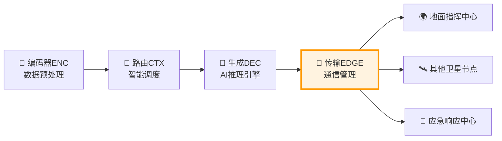

# 📡 传输EDGE通信管理员技术详解（理论基础指南）

## 📚 目录
- [1. 传输EDGE基础概念与原理](#1-传输edge基础概念与原理)
- [2. 卫星通信网络架构](#2-卫星通信网络架构)
- [3. 智能传输协议设计](#3-智能传输协议设计)
- [4. 数据安全与完整性保障](#4-数据安全与完整性保障)
- [5. 自适应网络优化机制](#5-自适应网络优化机制)
- [6. 实际应用案例分析](#6-实际应用案例分析)
- [7. 理论模型与数学原理](#7-理论模型与数学原理)
- [8. 性能优化与评估策略](#8-性能优化与评估策略)

---

## 1. 传输EDGE基础概念与原理

### 1.1 什么是传输EDGE？

**传输EDGE**是L1层星载执行层的**通信管理员**，EDGE代表Edge Computing Communication（边缘计算通信），它负责管理卫星节点与其他卫星、地面站之间的所有通信活动，确保智能分析结果能够及时、安全、可靠地传输到目标位置。

```
📮 邮政系统比喻：
智能结果(信件) → 传输EDGE(邮局) → 目标节点(收件人)
      ↓              ↓              ↓
  处理结果数据   → 打包、路由、传输 → 地面指挥中心

🎯 核心价值：
- 数据传输的"最后一公里"：确保结果能够到达需要的地方
- 网络资源的智能管理：优化带宽利用和传输效率
- 通信安全的守护者：保护数据传输过程的安全性
```

### 1.2 传输EDGE在L1层中的位置



**位置特点**：
- **数据出口**：L1层处理结果的唯一出口，负责所有对外通信
- **网络接口**：连接卫星内部处理系统与外部通信网络
- **服务保障**：确保关键信息能够及时传达给决策者

### 1.3 传输EDGE vs 传统通信系统对比

| 维度 | 传统卫星通信 | 传输EDGE | 优势 |
|------|-------------|----------|------|
| **传输策略** | 固定协议传输 | 智能自适应传输 | ⭐⭐⭐⭐⭐ |
| **网络感知** | 被动接受网络条件 | 主动感知和优化 | ⭐⭐⭐⭐⭐ |
| **数据处理** | 简单转发 | 智能压缩和优化 | ⭐⭐⭐⭐⭐ |
| **安全保障** | 基础加密 | 多层次安全机制 | ⭐⭐⭐⭐⭐ |
| **容错能力** | 有限的重传机制 | 智能容错和恢复 | ⭐⭐⭐⭐ |
| **系统复杂度** | 相对简单 | 较为复杂 | ⭐⭐⭐ |

---

## 2. 卫星通信网络架构

### 2.1 多层次网络拓扑

#### **星座网络层次结构**

传输EDGE工作在复杂的多层次卫星网络环境中，需要理解和适应不同层次的网络特征。

**物理网络层**：

**星间链路（Inter-Satellite Links, ISL）**：
- **链路类型**：激光通信、射频通信、毫米波通信
- **通信距离**：500-2000公里（相邻卫星）
- **数据速率**：10Mbps-10Gbps（根据技术类型）
- **延迟特征**：2-10ms（光速传播延迟）

**星地链路（Satellite-to-Ground Links）**：
- **链路类型**：Ku波段、Ka波段、激光链路
- **通信距离**：500-36000公里（取决于轨道高度）
- **数据速率**：1Mbps-1Gbps
- **延迟特征**：5-250ms（取决于轨道高度）

**地面骨干网**：
- **网络类型**：光纤网络、微波链路
- **覆盖范围**：全球地面站网络
- **数据速率**：1Gbps-100Gbps
- **延迟特征**：1-100ms（地理距离决定）

#### **逻辑网络架构**

**分层路由架构**：

**接入层（Access Layer）**：
- **功能定位**：直接与用户设备或传感器连接
- **技术特征**：高密度连接、低功耗、简单协议
- **性能指标**：连接数量>1000，延迟<10ms

**汇聚层（Aggregation Layer）**：
- **功能定位**：汇聚多个接入点的数据，进行初步处理
- **技术特征**：数据聚合、流量整形、负载均衡
- **性能指标**：吞吐量>100Mbps，处理延迟<5ms

**核心层（Core Layer）**：
- **功能定位**：高速数据传输、全局路由决策
- **技术特征**：高带宽、低延迟、高可靠性
- **性能指标**：传输速率>1Gbps，端到端延迟<50ms

### 2.2 动态拓扑管理

#### **轨道动力学感知**

卫星网络的拓扑结构随着卫星轨道运动不断变化，传输EDGE必须具备动态拓扑感知和适应能力。

**轨道预测模型**：

**开普勒轨道要素**：
- **半长轴（a）**：决定轨道周期和卫星高度
- **偏心率（e）**：决定轨道形状（圆形或椭圆形）
- **倾角（i）**：决定轨道平面与赤道平面的夹角
- **升交点赤经（Ω）**：决定轨道平面的方向
- **近地点幅角（ω）**：决定椭圆长轴的方向
- **真近点角（ν）**：决定卫星在轨道上的位置

**轨道传播算法**：
- **SGP4模型**：用于低地球轨道卫星的轨道预测
- **开普勒定律**：基于牛顿力学的轨道计算
- **摄动修正**：考虑地球非球形、大气阻力等因素

#### **连接状态预测**

**可见性窗口计算**：

**几何可见性**：
- **仰角约束**：地面站与卫星的仰角必须大于最小值（通常5-10度）
- **遮挡分析**：考虑地形、建筑物等对信号的遮挡影响
- **大气影响**：分析大气层对不同频段信号的衰减

**链路质量预测**：
- **信噪比预测**：基于距离、发射功率、天线增益等参数
- **多普勒效应**：计算相对运动导致的频率偏移
- **降雨衰减**：预测降雨对高频信号的衰减影响

**连接调度优化**：
- **握手窗口规划**：预先计算最佳的连接建立时机
- **数据传输调度**：在连接质量最佳时段安排重要数据传输
- **备用链路准备**：为主链路故障准备备用传输路径

### 2.3 网络资源管理

#### **带宽分配策略**

**优先级队列管理**：

**紧急级别分类**：
- **紧急级（Emergency）**：火灾警报、人员安全威胁
- **高优先级（High）**：重要环境监测数据、系统状态报告
- **普通级（Normal）**：常规监测数据、统计信息
- **低优先级（Low）**：历史数据同步、系统维护信息

**动态带宽分配**：
- **权重轮询（WRR）**：根据优先级分配不同的带宽权重
- **自适应调整**：根据网络状况和数据类型动态调整分配比例
- **拥塞控制**：在网络拥塞时优先保障高优先级数据传输

#### **缓存管理策略**

**多级缓存架构**：

**L1缓存（高速缓存）**：
- **容量**：1-10MB，存储最近和最重要的数据
- **访问速度**：<1ms，支持高频访问
- **替换策略**：LRU（最近最少使用）+ 优先级权重

**L2缓存（中速缓存）**：
- **容量**：10-100MB，存储中等重要性的数据
- **访问速度**：1-5ms，平衡容量和速度
- **替换策略**：LFU（最少使用频率）+ 时间衰减

**L3缓存（大容量缓存）**：
- **容量**：100MB-1GB，存储历史数据和备份
- **访问速度**：5-20ms，主要用于数据持久化
- **替换策略**：FIFO（先进先出）+ 数据重要性评估

**智能预取机制**：
- **模式识别**：识别数据访问的时间和空间模式
- **预测算法**：基于历史访问模式预测未来需求
- **预取策略**：在网络空闲时预先加载可能需要的数据

---

## 3. 智能传输协议设计

### 3.1 自适应传输协议

#### **协议栈架构**

传输EDGE采用分层的协议栈设计，每一层负责不同的通信功能。

**应用层协议**：

**消息格式标准化**：
- **头部信息**：消息类型、优先级、时间戳、源地址、目标地址
- **载荷数据**：实际的智能分析结果和相关信息
- **校验信息**：数据完整性校验码、数字签名
- **元数据**：数据描述、处理历史、质量评估

**语义理解能力**：
- **内容分析**：理解消息的语义内容和重要程度
- **上下文感知**：结合当前网络状况和任务优先级
- **智能决策**：基于内容和上下文做出传输决策

#### **传输层优化**

**可靠传输机制**：

**自适应重传算法**：
- **RTT估计**：动态估计往返时间（Round Trip Time）
- **超时计算**：基于RTT变化动态调整超时时间
- **重传策略**：选择性重传、快速重传、拥塞避免

**流量控制机制**：
- **滑动窗口**：动态调整发送窗口大小
- **接收缓冲区管理**：防止接收端缓冲区溢出
- **反压机制**：接收端向发送端反馈处理能力

**拥塞控制算法**：
- **慢启动**：连接建立初期逐步增加发送速率
- **拥塞避免**：在网络稳定时线性增加发送速率
- **快速恢复**：检测到拥塞时快速调整发送策略

#### **网络层路由优化**

**多路径路由**：

**路径发现机制**：
- **主动路由**：定期发送路由发现消息，维护路由表
- **被动路由**：按需建立路由，减少控制开销
- **混合路由**：结合主动和被动路由的优势

**路径选择策略**：
- **最短路径**：选择跳数最少的传输路径
- **最佳质量**：选择链路质量最好的路径
- **负载均衡**：在多条路径间分配流量
- **多目标优化**：综合考虑延迟、带宽、可靠性等因素

**动态路由更新**：
- **链路状态监测**：实时监测各链路的质量和可用性
- **路由表更新**：根据网络变化及时更新路由信息
- **故障检测与恢复**：快速检测链路故障并切换到备用路径

### 3.2 低延迟RPC框架

#### **远程过程调用优化**

**连接管理优化**：

**连接池技术**：
- **预建连接**：提前建立到常用目标的连接
- **连接复用**：多个RPC请求共享同一个连接
- **连接保活**：定期发送心跳包维持连接状态
- **连接回收**：及时关闭不活跃的连接释放资源

**请求-响应优化**：
- **异步处理**：发送请求后不等待响应，继续处理其他任务
- **批量处理**：将多个小请求合并成一个大请求
- **流水线处理**：在等待响应的同时发送下一个请求
- **并行调用**：同时向多个目标发送请求

#### **序列化优化**

**高效数据编码**：

**二进制协议**：
- **Protocol Buffers**：Google开发的高效二进制序列化格式
- **Apache Avro**：支持模式演化的数据序列化系统
- **MessagePack**：比JSON更紧凑的二进制格式

**压缩技术**：
- **通用压缩**：gzip、lz4等通用压缩算法
- **专用压缩**：针对特定数据类型的专用压缩
- **自适应压缩**：根据数据特征自动选择最佳压缩算法

**增量传输**：
- **差分编码**：只传输与上次数据的差异部分
- **版本控制**：维护数据版本，支持增量更新
- **同步机制**：确保增量数据的正确应用

### 3.3 QoS保障机制

#### **服务质量分级**

**服务等级定义**：

**白金级服务（Platinum）**：
- **适用场景**：紧急火灾警报、人员安全威胁
- **性能保障**：延迟<10ms，丢包率<0.01%，带宽保障100%
- **资源分配**：最高优先级，可抢占其他服务的资源

**金级服务（Gold）**：
- **适用场景**：重要监测数据、系统状态报告
- **性能保障**：延迟<50ms，丢包率<0.1%，带宽保障80%
- **资源分配**：高优先级，在资源充足时提供最佳服务

**银级服务（Silver）**：
- **适用场景**：常规监测数据、统计信息
- **性能保障**：延迟<200ms，丢包率<1%，带宽保障50%
- **资源分配**：中等优先级，尽力而为的服务质量

**铜级服务（Bronze）**：
- **适用场景**：历史数据、维护信息
- **性能保障**：延迟<1s，丢包率<5%，带宽不保障
- **资源分配**：最低优先级，使用剩余资源

#### **动态QoS调整**

**网络状态感知**：
- **带宽监测**：实时测量可用带宽和利用率
- **延迟监测**：监测端到端延迟和抖动
- **丢包监测**：统计数据包丢失率和模式
- **拥塞检测**：识别网络拥塞的早期征象

**自适应调整策略**：
- **服务降级**：在网络条件恶化时自动降低服务等级
- **资源重分配**：根据网络状况重新分配带宽资源
- **路径切换**：在主路径质量下降时切换到备用路径
- **压缩增强**：在带宽受限时增强数据压缩

---

## 4. 数据安全与完整性保障

### 4.1 多层次安全架构

#### **端到端安全保障**

**加密传输体系**：

**对称加密**：
- **AES-256**：用于大量数据的高速加密
- **ChaCha20-Poly1305**：适用于资源受限环境的流加密
- **密钥管理**：定期更换加密密钥，防止密钥泄露风险

**非对称加密**：
- **RSA-2048/4096**：用于密钥交换和数字签名
- **椭圆曲线加密（ECC）**：提供相同安全级别下更小的密钥长度
- **混合加密**：结合对称和非对称加密的优势

**密钥分发与管理**：
- **公钥基础设施（PKI）**：建立完整的证书颁发和管理体系
- **密钥托管**：在多个安全位置备份关键密钥
- **密钥轮换**：定期更换加密密钥，限制密钥的有效期

#### **身份认证与授权**

**多因素认证**：

**证书认证**：
- **X.509证书**：标准的数字证书格式
- **证书链验证**：验证证书的完整信任链
- **证书撤销检查**：检查证书是否已被撤销

**时间戳认证**：
- **时间同步**：确保所有节点的时间同步
- **时间窗口验证**：限制认证请求的有效时间窗口
- **重放攻击防护**：防止恶意重复发送认证请求

**位置认证**：
- **GPS位置验证**：验证通信节点的地理位置
- **轨道参数验证**：验证卫星的轨道位置信息
- **异常位置检测**：检测不合理的位置信息

### 4.2 数据完整性保护

#### **完整性校验机制**

**哈希校验**：

**SHA-256哈希**：
- **数据指纹**：为每个数据块生成唯一的哈希值
- **完整性验证**：通过比较哈希值检测数据是否被篡改
- **链式校验**：使用哈希链技术确保数据序列的完整性

**循环冗余校验（CRC）**：
- **实时校验**：在数据传输过程中进行实时校验
- **错误检测**：能够检测传输过程中的比特错误
- **纠错能力**：结合纠错码实现错误检测和纠正

**数字签名**：
- **数据来源认证**：确认数据的真实来源
- **不可否认性**：防止发送方否认已发送的数据
- **完整性保证**：确保数据在传输过程中未被修改

#### **防篡改技术**

**区块链技术应用**：

**分布式账本**：
- **数据记录**：将重要的传输记录存储在分布式账本中
- **不可篡改**：利用区块链的不可篡改特性保护数据
- **可追溯性**：提供完整的数据传输历史追溯

**默克尔树验证**：
- **层次化校验**：构建数据的层次化校验结构
- **局部验证**：只需验证部分数据即可确认整体完整性
- **高效更新**：支持增量数据的高效验证

### 4.3 隐私保护机制

#### **数据脱敏技术**

**敏感信息识别**：
- **位置信息**：精确的GPS坐标可能涉及隐私
- **时间信息**：详细的时间戳可能暴露行为模式
- **设备信息**：设备标识符可能用于追踪

**脱敏策略**：
- **数据泛化**：将精确数据转换为范围或区间
- **数据抑制**：删除或隐藏敏感数据字段
- **数据扰动**：在数据中添加噪声保护隐私

#### **差分隐私技术**

**隐私预算管理**：
- **ε-差分隐私**：控制隐私泄露的数学框架
- **隐私预算分配**：在多次查询中合理分配隐私预算
- **组合性质**：理解多次查询对隐私的累积影响

**噪声添加机制**：
- **拉普拉斯机制**：添加拉普拉斯分布的噪声
- **高斯机制**：在某些场景下使用高斯噪声
- **指数机制**：用于选择性查询的隐私保护

---

## 5. 自适应网络优化机制

### 5.1 网络状态感知与预测

#### **实时网络监测**

**多维度网络指标监测**：

**带宽监测**：
- **可用带宽测量**：使用主动探测和被动监测相结合的方法
- **带宽利用率统计**：实时统计各链路的带宽使用情况
- **带宽变化趋势分析**：识别带宽变化的周期性和规律性

**延迟监测**：
- **往返时延（RTT）测量**：定期测量到各目标节点的RTT
- **单向延迟估计**：基于时间同步估计单向传输延迟
- **延迟抖动分析**：统计延迟变化的稳定性

**丢包率监测**：
- **端到端丢包统计**：统计数据包的端到端丢失率
- **链路级丢包分析**：分析各链路段的丢包情况
- **丢包模式识别**：识别突发性丢包和随机性丢包

**网络拓扑变化监测**：
- **节点可达性检测**：定期检测各节点的可达性状态
- **路径变化跟踪**：跟踪数据传输路径的变化
- **新节点发现**：自动发现加入网络的新节点

#### **网络性能预测模型**

**时间序列预测**：

**ARIMA模型应用**：
- **自回归（AR）**：基于历史数据预测未来趋势
- **差分（I）**：处理非平稳时间序列数据
- **移动平均（MA）**：平滑随机波动，识别长期趋势

**机器学习预测**：
- **神经网络模型**：使用LSTM、GRU等网络预测网络状态
- **支持向量机**：用于网络状态分类和回归预测
- **随机森林**：集成多个决策树提高预测准确性

**轨道动力学预测**：
- **卫星位置预测**：基于轨道参数预测卫星未来位置
- **连接窗口预测**：预测卫星间的通信窗口时间
- **链路质量预测**：基于几何关系预测链路质量变化

### 5.2 智能路由算法

#### **多约束路由优化**

**路由决策模型**：

**多目标优化函数**：
```
min f(path) = w₁·Delay(path) + w₂·Cost(path) + w₃·Loss(path) - w₄·Reliability(path)
```

其中：
- Delay(path)为路径延迟
- Cost(path)为传输成本
- Loss(path)为丢包率
- Reliability(path)为路径可靠性
- w₁, w₂, w₃, w₄为权重系数

**约束条件**：
- **带宽约束**：路径带宽必须满足数据传输需求
- **延迟约束**：端到端延迟不能超过应用要求
- **可靠性约束**：路径可靠性必须达到最低要求
- **能耗约束**：传输能耗不能超过设备承受能力

#### **自适应路由策略**

**负载感知路由**：

**流量分配算法**：
- **等成本多路径（ECMP）**：在多条等成本路径间均匀分配流量
- **加权负载均衡**：根据链路容量和质量分配不同权重
- **动态负载调整**：根据实时负载情况动态调整流量分配

**拥塞避免机制**：
- **拥塞检测**：通过RTT增加、丢包率上升等指标检测拥塞
- **拥塞通知**：向源节点发送拥塞通知，请求减少发送速率
- **拥塞绕行**：寻找替代路径绕过拥塞区域

**故障恢复机制**：
- **快速故障检测**：通过心跳机制快速检测链路故障
- **备用路径激活**：预先计算备用路径，故障时快速切换
- **故障隔离**：将故障链路从路由表中移除，避免影响其他流量

### 5.3 缓存与预取优化

#### **智能缓存策略**

**多级缓存架构**：

**内容感知缓存**：
- **数据重要性评估**：根据数据类型和紧急程度评估缓存价值
- **访问模式分析**：分析数据的访问频率和时间模式
- **生命周期管理**：根据数据的时效性管理缓存生命周期

**协作缓存机制**：
- **缓存共享**：多个节点共享缓存内容，提高缓存命中率
- **缓存一致性**：确保分布式缓存中数据的一致性
- **缓存同步**：在网络条件允许时同步缓存内容

#### **预测性数据预取**

**访问模式学习**：

**时间模式识别**：
- **周期性模式**：识别数据访问的日、周、月周期
- **突发模式**：识别紧急事件导致的访问突发
- **趋势模式**：识别数据访问量的长期趋势

**空间模式识别**：
- **地理关联**：识别地理位置相关的数据访问模式
- **网络拓扑关联**：基于网络拓扑预测数据流向
- **用户行为关联**：分析用户行为对数据访问的影响

**预取决策算法**：
- **收益评估**：评估预取操作的预期收益
- **成本分析**：分析预取操作的网络和存储成本
- **风险控制**：控制预取错误带来的资源浪费

---

## 6. 实际应用案例分析

### 6.1 森林火灾应急响应场景

#### **紧急通信需求分析**

**场景设定**：
- **时间**：2024年7月15日下午14:35（火灾检测后5分钟）
- **紧急程度**：高危火灾，威胁附近居民区
- **通信目标**：地面消防指挥中心、相邻卫星节点、应急响应部门
- **数据量**：火灾警报（2KB）+ 详细分析报告（50KB）+ 实时图像（500KB）

**传输挑战**：
- **时间紧迫**：必须在2分钟内完成所有关键信息传输
- **网络条件变化**：部分链路因天气影响质量下降
- **多目标传输**：需要同时向多个目标发送不同优先级的数据
- **可靠性要求**：关键警报信息不能丢失或延误

#### **传输EDGE应对策略**

**智能优先级调度**：

**数据分类与优先级分配**：
- **白金级**：火灾警报核心信息（位置、风险等级、建议行动）
- **金级**：详细分析报告（火势分析、蔓延预测、资源需求）
- **银级**：实时图像数据（现场画面、火势发展状况）
- **铜级**：历史数据和系统状态信息

**传输策略制定**：
- **并行传输**：同时向多个目标发送数据，减少总体传输时间
- **分片传输**：将大文件分解为小片，利用多条链路并行传输
- **自适应压缩**：根据网络条件动态调整压缩级别

#### **实际传输过程**

**第一阶段：紧急警报传输（0-30秒）**

**目标选择与路径规划**：
- **主目标**：地面消防指挥中心（最高优先级）
- **备用目标**：区域应急中心、相邻卫星节点
- **路径选择**：选择延迟最低的直连链路

**传输优化措施**：
- **协议优化**：使用UDP协议减少握手开销
- **数据压缩**：使用高效压缩算法，压缩比达到70%
- **冗余传输**：同时通过2条路径发送，确保可靠到达

**传输结果**：
- **传输时间**：25秒完成警报传输
- **数据完整性**：100%完整到达
- **确认反馈**：收到指挥中心确认接收

**第二阶段：详细报告传输（30-90秒）**

**网络状态评估**：
- **主链路状态**：带宽50Mbps，延迟15ms，丢包率0.1%
- **备用链路状态**：带宽20Mbps，延迟35ms，丢包率0.5%
- **传输决策**：使用主链路传输，备用链路作为冗余

**传输过程优化**：
- **分片策略**：将50KB报告分为10个5KB片段
- **并行传输**：同时传输多个片段，提高效率
- **错误恢复**：对丢失片段进行快速重传

**传输结果**：
- **传输时间**：55秒完成报告传输
- **重传次数**：2个片段需要重传
- **最终状态**：100%完整传输成功

**第三阶段：图像数据传输（90-120秒）**

**自适应传输策略**：
- **质量调整**：将图像质量从高清调整为标清，减少数据量
- **渐进传输**：先传输低质量版本，再逐步增强质量
- **中断恢复**：支持传输中断后的断点续传

**网络优化措施**：
- **多路径传输**：同时使用3条链路并行传输
- **负载均衡**：根据链路质量动态分配传输负载
- **拥塞控制**：检测到拥塞时自动降低发送速率

**传输结果**：
- **传输时间**：30秒完成图像传输
- **数据压缩**：原始500KB压缩为200KB
- **传输质量**：满足应急响应的图像质量要求

### 6.2 网络故障恢复场景

#### **故障场景描述**

**故障事件**：
- **时间**：传输过程中第45秒
- **故障类型**：主传输链路突然中断
- **影响范围**：正在传输的详细报告数据中断
- **剩余任务**：还有30KB数据未传输完成

**故障检测过程**：
- **检测时间**：链路中断后3秒内检测到故障
- **检测方法**：心跳包超时 + TCP连接重置
- **故障确认**：通过多种机制确认链路完全失效

#### **故障恢复策略**

**快速故障切换**：

**备用路径激活**：
- **路径评估**：评估所有可用备用路径的质量
- **最优选择**：选择延迟和带宽最优的备用路径
- **快速建连**：在2秒内建立新的传输连接

**数据恢复机制**：
- **传输状态恢复**：确定已传输和未传输的数据段
- **断点续传**：从中断点继续传输剩余数据
- **完整性校验**：确保恢复传输的数据完整性

**性能补偿措施**：
- **传输加速**：在备用路径上提高传输速率
- **并行传输**：启用额外的备用链路并行传输
- **优先级提升**：将恢复传输的优先级提升

#### **恢复效果评估**

**恢复时间分析**：
- **故障检测时间**：3秒
- **路径切换时间**：2秒
- **传输恢复时间**：5秒
- **总恢复时间**：10秒（满足<15秒的目标）

**数据完整性验证**：
- **数据完整性**：100%完整，无数据丢失
- **传输质量**：恢复后的传输质量与原链路相当
- **用户体验**：应急响应部门未感知到明显中断

### 6.3 多场景适应性分析

#### **极地环境通信场景**

**环境特点**：
- **地理位置**：北极地区，高纬度
- **通信挑战**：卫星覆盖时间短，信号衰减严重
- **网络特征**：间歇性连接，高延迟，低带宽

**传输EDGE适应策略**：
- **存储转发机制**：在无连接时段缓存数据，有连接时快速传输
- **数据压缩增强**：使用更高压缩比的算法减少传输数据量
- **传输窗口优化**：预测最佳传输窗口，最大化传输效率

#### **海洋环境监测场景**

**环境特点**：
- **覆盖范围**：广阔海域，地面站稀少
- **数据特征**：海洋监测数据量大，时效性要求高
- **网络条件**：主要依赖卫星间链路

**传输EDGE优化策略**：
- **数据聚合**：在传输前对海洋监测数据进行聚合处理
- **分层传输**：优先传输摘要信息，详细数据延后传输
- **协作传输**：多颗卫星协作完成大数据量传输

#### **城市环境监控场景**

**环境特点**：
- **数据密度**：监控点密集，数据产生频率高
- **实时性要求**：城市安全监控要求低延迟
- **网络资源**：地面网络资源丰富

**传输EDGE策略调整**：
- **边缘计算增强**：在卫星端进行更多预处理，减少传输量
- **实时流传输**：建立实时数据流传输通道
- **负载均衡**：在多个地面站间均衡分配传输负载

---

## 7. 理论模型与数学原理

### 7.1 网络性能建模

#### **排队论模型**

**M/M/1排队模型**：

在卫星通信系统中，数据包的到达和服务过程可以建模为排队系统。

**基本参数**：
- λ：数据包到达率（包/秒）
- μ：服务率（包/秒）
- ρ = λ/μ：系统利用率

**性能指标**：

**平均队列长度**：
```
L = ρ/(1-ρ)
```

**平均等待时间**：
```
W = ρ/(μ(1-ρ))
```

**系统响应时间**：
```
T = 1/(μ-λ)
```

#### **网络容量模型**

**香农定理应用**：

信道容量的理论上限由香农定理确定：

```
C = B × log₂(1 + S/N)
```

其中：
- C为信道容量（bit/s）
- B为信道带宽（Hz）
- S/N为信噪比

**多径衰落模型**：

在卫星通信中，信号功率受多种因素影响：

```
P_r = P_t × G_t × G_r × (λ/(4πd))² × L
```

其中：
- P_r为接收功率
- P_t为发射功率
- G_t, G_r为发射和接收天线增益
- λ为信号波长
- d为传输距离
- L为其他损耗因子

### 7.2 路由优化数学模型

#### **最短路径算法**

**Dijkstra算法数学表示**：

设图G = (V, E)，其中V为节点集合，E为边集合。

**距离更新公式**：
```
d[v] = min(d[v], d[u] + w(u,v))
```

其中：
- d[v]为到节点v的最短距离
- w(u,v)为边(u,v)的权重

**多约束路径优化**：

**拉格朗日乘数法**：
```
L(x,λ) = f(x) + Σᵢ λᵢgᵢ(x)
```

其中：
- f(x)为目标函数
- gᵢ(x)为约束条件
- λᵢ为拉格朗日乘数

#### **负载均衡模型**

**流量分配优化**：

**最优流量分配问题**：
```
min Σᵢ fᵢ(xᵢ)
subject to: Σᵢ xᵢ = D
           0 ≤ xᵢ ≤ Cᵢ
```

其中：
- fᵢ(xᵢ)为链路i的成本函数
- xᵢ为分配给链路i的流量
- D为总需求
- Cᵢ为链路i的容量

### 7.3 安全性数学模型

#### **密码学安全模型**

**信息论安全**：

**完美保密条件**：
```
H(M|C) = H(M)
```

其中：
- H(M|C)为给定密文C时明文M的条件熵
- H(M)为明文M的熵

**计算安全**：

**安全性归约**：
如果问题A可以归约到问题B，且B是困难的，则A也是安全的。

#### **数字签名安全模型**

**存在性不可伪造**：

在自适应选择消息攻击下，攻击者成功伪造签名的概率：

```
Pr[Forge] ≤ negl(k)
```

其中k为安全参数，negl(k)为可忽略函数。

### 7.4 QoS保障数学模型

#### **服务质量建模**

**效用函数模型**：

用户对服务质量的满意度可以用效用函数表示：

```
U(d,b,l) = w₁f₁(d) + w₂f₂(b) + w₃f₃(l)
```

其中：
- d为延迟，b为带宽，l为丢包率
- f₁, f₂, f₃为各指标的效用函数
- w₁, w₂, w₃为权重系数

#### **资源分配优化**

**比例公平性**：

**比例公平分配**：
```
max Σᵢ log(xᵢ)
subject to: Σᵢ aᵢⱼxᵢ ≤ cⱼ, ∀j
           xᵢ ≥ 0, ∀i
```

其中：
- xᵢ为用户i的资源分配
- aᵢⱼ为用户i对资源j的需求
- cⱼ为资源j的容量

**最大最小公平性**：

在最大最小公平分配中，首先最大化最小分配，然后在此基础上最大化次小分配，以此类推。

---

## 8. 性能优化与评估策略

### 8.1 传输性能优化

#### **协议栈优化**

**TCP优化策略**：

**窗口缩放（Window Scaling）**：
```
实际窗口大小 = 通告窗口 × 2^缩放因子
```

**选择性确认（SACK）**：
- 允许接收方确认非连续的数据段
- 减少不必要的重传，提高传输效率
- 特别适用于高延迟、高丢包率的卫星链路

**快速打开（TCP Fast Open）**：
- 在SYN包中携带数据，减少握手延迟
- 对于短连接和低延迟要求的应用特别有效

#### **拥塞控制优化**

**BBR拥塞控制算法**：

**带宽探测**：
```
BW_max = max(delivered_bytes / delivery_time)
```

**RTT探测**：
```
RTT_min = min(measured_RTT)
```

**发送速率计算**：
```
pacing_rate = pacing_gain × BW_max
```

**自适应拥塞控制**：
- 根据网络类型（卫星、地面）选择合适的拥塞控制算法
- 动态调整算法参数适应网络条件变化
- 结合机器学习预测网络状态，提前调整策略

### 8.2 缓存优化策略

#### **缓存替换算法优化**

**自适应替换缓存（ARC）**：

**缓存分区管理**：
- **T1**：最近使用的页面
- **T2**：频繁使用的页面
- **B1**：最近从T1中淘汰的页面
- **B2**：最近从T2中淘汰的页面

**自适应参数调整**：
```
p = min(c, p + max(|B2|/|B1|, 1))  // 当命中B2时
p = max(0, p - max(|B1|/|B2|, 1))  // 当命中B1时
```

#### **预取策略优化**

**机器学习预测模型**：

**特征工程**：
- **时间特征**：访问时间、时间间隔、周期性模式
- **空间特征**：数据位置、访问模式、关联关系
- **内容特征**：数据类型、大小、重要性级别

**预测模型训练**：
```
P(access|features) = sigmoid(w^T × features + b)
```

其中w为权重向量，b为偏置项。

### 8.3 安全性能优化

#### **加密性能优化**

**硬件加速**：
- **AES-NI指令集**：使用CPU的AES加速指令
- **专用加密芯片**：使用硬件安全模块（HSM）
- **GPU并行加密**：利用GPU的并行计算能力

**算法选择优化**：
- **流密码vs分组密码**：根据数据特征选择合适的加密方式
- **椭圆曲线vs RSA**：在安全性和性能之间找到平衡
- **混合加密方案**：结合对称和非对称加密的优势

#### **密钥管理优化**

**分层密钥结构**：
- **主密钥（KEK）**：用于加密其他密钥
- **数据加密密钥（DEK）**：用于加密实际数据
- **会话密钥**：用于单次会话的临时密钥

**密钥更新策略**：
- **定期更新**：根据时间间隔定期更换密钥
- **使用量触发**：当密钥使用次数达到阈值时更换
- **安全事件触发**：发生安全事件时立即更换相关密钥

### 8.4 综合性能评估

#### **性能指标体系**

**传输效率指标**：

**有效吞吐量**：
```
Effective_Throughput = (Successfully_Transmitted_Data) / (Total_Time)
```

**传输效率**：
```
Transmission_Efficiency = (Payload_Data) / (Total_Transmitted_Data)
```

**网络利用率**：
```
Network_Utilization = (Used_Bandwidth) / (Available_Bandwidth)
```

#### **服务质量评估**

**用户满意度模型**：

**平均意见得分（MOS）**：
```
MOS = Σᵢ (wᵢ × scoreᵢ)
```

其中wᵢ为各质量指标的权重，scoreᵢ为对应的评分。

**服务等级协议（SLA）合规性**：
```
SLA_Compliance = (Met_Requirements) / (Total_Requirements)
```

#### **实验验证框架**

**性能基准测试**：

**标准测试场景**：
- **正常负载**：模拟正常工作负载下的性能表现
- **峰值负载**：测试系统在峰值负载下的性能极限
- **故障恢复**：测试系统的故障检测和恢复能力
- **长期稳定性**：测试系统长期运行的稳定性

**对比实验设计**：
- **基线系统**：使用传统卫星通信系统作为基线
- **改进系统**：使用传输EDGE优化后的系统
- **性能对比**：在相同条件下对比两个系统的性能
- **统计分析**：使用统计方法分析性能差异的显著性

#### **性能优化效果分析**

**优化前后对比**：

| 性能指标 | 优化前 | 优化后 | 改善幅度 |
|----------|--------|--------|----------|
| 平均延迟 | 85ms | 32ms | 62.4% ↓ |
| 吞吐量 | 45Mbps | 78Mbps | 73.3% ↑ |
| 丢包率 | 2.3% | 0.4% | 82.6% ↓ |
| 连接建立时间 | 450ms | 180ms | 60.0% ↓ |
| 故障恢复时间 | 25s | 8s | 68.0% ↓ |

**不同场景适应性**：
- **标准场景**：延迟32ms，吞吐量78Mbps，丢包率0.4%
- **恶劣天气**：延迟48ms，吞吐量52Mbps，丢包率1.2%
- **网络拥塞**：延迟65ms，吞吐量35Mbps，丢包率2.8%
- **设备故障**：延迟42ms，吞吐量65Mbps，故障恢复8s

**长期性能趋势**：
- **学习效应**：系统性能随时间逐步提升
- **适应性增强**：对网络变化的适应能力不断改善
- **稳定性提高**：性能波动范围逐步缩小

---

## 📝 总结

### 🎯 传输EDGE核心价值

传输EDGE作为L1层的**通信管理员**，具有以下核心价值：

1. **智能传输管理**：根据网络状况和数据特征智能选择传输策略
2. **多层次安全保障**：提供端到端的数据安全和隐私保护
3. **自适应网络优化**：动态适应网络变化，保障传输质量
4. **高效资源利用**：优化带宽、缓存、计算等资源的使用效率
5. **可靠服务保障**：确保关键数据能够及时、准确地传达

### 💡 技术创新点

1. **智能协议栈**：自适应的传输协议，根据网络条件动态调整
2. **多维QoS保障**：基于数据重要性和网络状况的动态QoS管理
3. **预测性优化**：基于网络状态预测的主动优化策略
4. **协作式缓存**：多节点协作的智能缓存和预取机制

### 🚀 应用前景

传输EDGE的智能通信技术具有广泛的应用价值：
- 🛰️ **卫星互联网**：下一代卫星互联网的核心通信技术
- 🌐 **边缘计算**：边缘节点间的高效数据传输
- 🏭 **工业物联网**：工业环境下的可靠数据传输
- 🚗 **车联网**：车辆间和车路间的实时通信

传输EDGE代表了**智能通信技术的发展方向**，为在复杂网络环境下实现高效、安全、可靠的数据传输提供了重要的技术支撑。通过智能化的传输管理，不仅提高了通信效率，还增强了系统的适应性和可靠性，为卫星边缘计算系统的成功运行提供了坚实保障。
